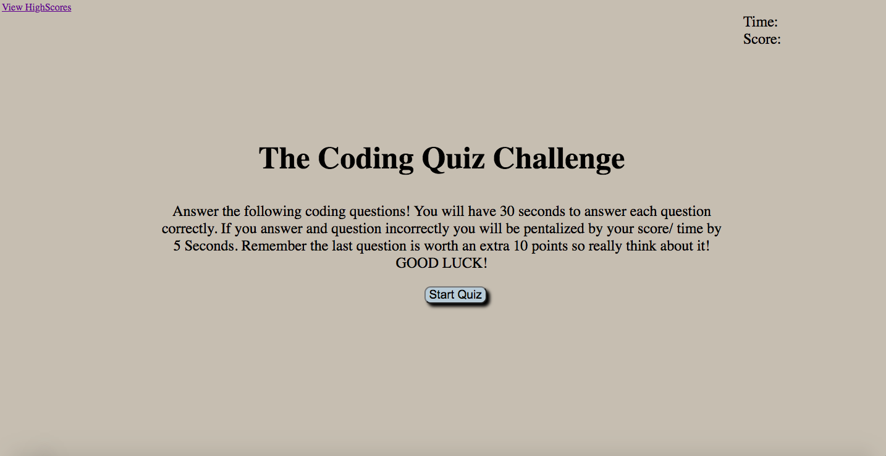

# challenge-4-code-quiz

## Description
  
  In this challenge I created a quiz code. When the start button was clicked a question appears, and a timer is presented counting down the seconds. When the question is answered the user is then presented with another question to be answered. When the user clicks the incorrect answer time from the clock is subtracted by 5 seconds. When all the questions are answered the user reaches a gameover screen. When the timer reachs 0 the user is also prompted to the gameover screen. Once the user has ended the game the user is able to save their initials. Their initials is then displayed on the highscores page. 

## Installation

N/A

## Usage

With this challenge the user is able to interact with the webpage and take a quiz. Once the user is done the user is able to read their score presented on the webpage. 

https://vitafomin.github.io/challenge-4-code-quiz/

## Credits

N/A

## License

Please refer to the LICENSE in the repo
